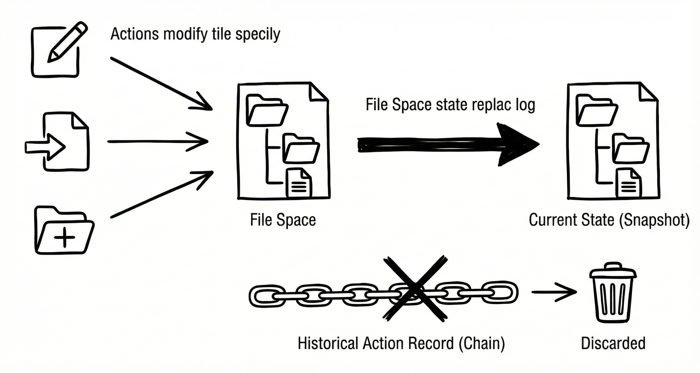
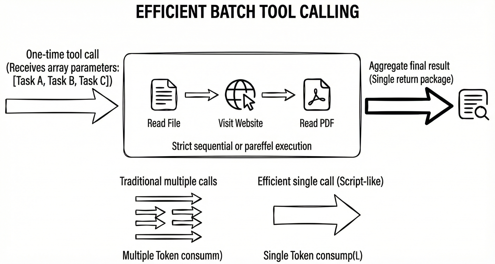

# Replacing History with State  
## A New Way to Build Context for Intelligent Agents

This post introduces a **battle-tested way to construct context for AI agents**, originating from an open-source GitHub project: **infiAgent**.
👉 https://github.com/ChenglinPoly/infiAgent

The core idea is simple:  
> **stop feeding agents their entire action history, and give them a compact state instead.**

This design allows agents to **retain their original intelligence from step one to step infinity**, even when executing very long and complex tasks.

The framework has been used to stably complete tasks such as:

- End-to-end research paper generation  
- Long-running scientific experiments  
- Logistics scheduling and truck loading optimization  

In fact, some papers generated autonomously using this framework have **passed peer review**.

---

## The Bottleneck of Mainstream Agents

Claude Code is currently considered by many developers to be a first-tier, semi-general agent. Still, it has clear limitations.

Recently, I used Claude Code for a long-horizon task that wasn’t particularly exotic:

> **Read 80 relatively long PDF papers and score them across six dimensions.**

At first glance, the output looked correct—it produced a complete scoring table for all 80 papers.

But when I reviewed the session logs, I found something unsettling:

> **It had actually read only about 10 papers.**  
> The scores and comments for the remaining papers were **guessed purely from their titles**.

This is not a Claude-specific issue. It is a common failure mode of modern agents.

Most agents today are optimized for **passing the task**, not **faithfully executing it**.  
In long-context tasks, aggressive compression inevitably destroys information, and agents begin to favor faster completion over correctness.

---

## A New Paradigm

To address this problem, the framework introduces several improvements over traditional agent designs.  
After studying the system closely, the real breakthroughs boil down to **three core ideas**.

---

## 1. Replacing History with State

This is the most important idea—and the title of this post.

The core change is radical but simple:

> **Tool results are no longer injected directly into the model context.**

Instead of returning content inline (web pages, search results, database queries, execution logs), **all tool outputs are written into the file system**.  
The agent is only told *where* the result is stored.

So:
- Browsing a webpage doesn’t dump HTML into context  
- Running code doesn’t flood the prompt with logs  
- Everything becomes files

### Key insight

> **All historical actions are equivalent to the current file system.**

The framework introduces a dedicated *thinking agent* that maintains a **compact index of the file space**:
- What each file contains
- Why it exists
- Its current status or summary

This tiny state description replaces hundreds—or thousands—of tool-call histories that would otherwise be compressed away.

In practice, the agent context contains only:
- A **short description of the file-system state**
- The **last ~10 steps of actions**

That’s it.

Whether the agent is on step 1 or step 10,000, the **context length stays almost constant**.

### Empirical result

I re-ran the same *“80-paper scoring”* task using this framework.

Even when using **Gemini Flash** (a weaker model than Claude Sonnet), the agent:

- Never got lost  
- Never hallucinated shortcuts  
- Read **all 80 papers fully**  
- Produced evaluations that actually reflected the content  

The run took longer—but the behavior was correct.

---

## 2. Tool Chaining / Batch Tool Calls

This idea is similar to Claude Code’s approach of chaining tools via bash scripts.

The goal is straightforward:

> **Reduce token usage and context overhead by batching operations.**

Instead of relying on scripts, batching is enforced **directly at the tool interface level**.

For example:
- File-reading tools accept **arrays only**
- Agents cannot read files one by one
- Bulk operations are mandatory

This forces agents to think in **structured, high-level operations**, and avoids repetitive calls that waste context and tokens.

---

## 3. An “Outer Attention Pipeline”

Although the framework claims not to perform compression, compression **does exist**—but at an extremely fine-grained level.

Instead of compressing based on total context length, the system compresses **each tool result at ingestion time**.

When a reading tool encounters content that is simply *too verbose* (even if it fits within the context window), it:

- Extracts only **task-relevant, high-attention content**
- Discards irrelevant details
- Injects only the distilled result into context

These tools are named things like:
answer_from_xxx

Agents are **required** to use these tools rather than loading raw files directly.

Combined with:
- File-system-based state (instead of history)
- Ultra-fine-grained content extraction

…the agent always operates on **short, high-value context**, making it far easier to choose the correct next action.

This also explains why **weaker models can still perform complex tasks** under this framework.

---

## Closing Thoughts

Every time it feels like agent technology is “basically solved,” reality proves otherwise.

Large models can already dominate math and programming competitions, yet their real-world performance remains fragile. Much of today’s agent boom may simply be **“vibe coding” hype**.

Model capability has raced ahead.  
**Application-level agent design has not.**

---

## Project

Implementation (open source):

👉 https://github.com/ChenglinPoly/infiAgent
